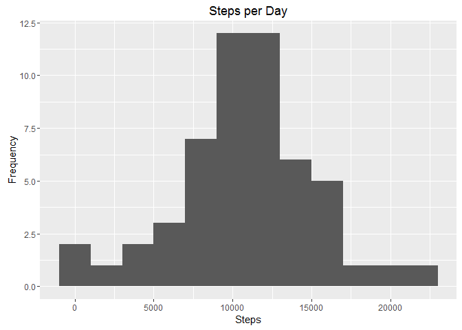
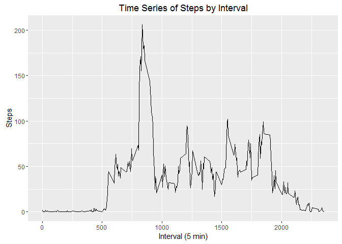
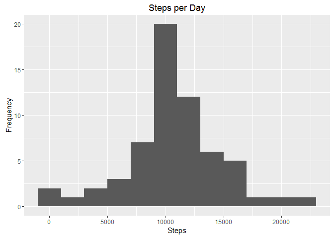
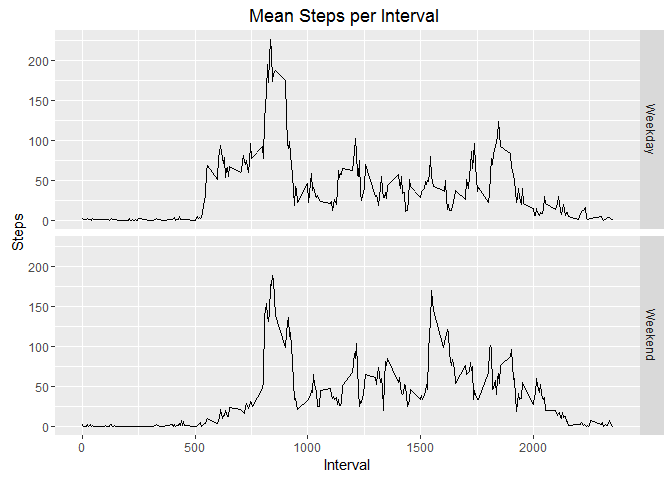

Libraries
---------

Load required libraries.

    library('ggplot2')

    ## Warning: package 'ggplot2' was built under R version 3.2.5

Loading and preprocessing the data
----------------------------------

1.  Load the Data

From the Repo, download and extract the Activity Monitoring Data
(repdata-data-activity.zip). Extract in the working directory and set
you directory, then import data.

    data <- read.csv("activity.csv")

1.  Process/transform the data (if necessary) into a format suitable for
    your analysis

Make an aggrated data set showing steps by day.

    aggSteps <- aggregate(steps ~ date,data,sum)
    head(aggSteps)

    ##         date steps
    ## 1 2012-10-02   126
    ## 2 2012-10-03 11352
    ## 3 2012-10-04 12116
    ## 4 2012-10-05 13294
    ## 5 2012-10-06 15420
    ## 6 2012-10-07 11015

What is the mean total number of steps taken per day?
-----------------------------------------------------

1.  Make a histogram of the total number of steps taken each day

<!-- -->

    p <- qplot(steps, data=aggSteps, geom="histogram", binwidth=2000)
    p <- p + labs(title = "Steps per Day", x = "Steps", y = "Frequency")
    p

1.  Calculate and report the mean and median total number of steps taken
    per day.

I like summary statistics, so here they are, mean and median included:

    summary(aggSteps$steps)

    ##    Min. 1st Qu.  Median    Mean 3rd Qu.    Max. 
    ##      41    8841   10760   10770   13290   21190

What is the average daily activity pattern?
-------------------------------------------

1.  Make a time series plot (i.e. type = "l") of the 5-minute
    interval (x-axis) and the average number of steps taken, averaged
    across all days (y-axis)

Use aggregate() and ggplot2 to make the plot.

    timeSteps <- aggregate(steps ~ interval,data,mean)
    ggplot(timeSteps, aes(interval,steps)) + geom_line() + xlab("Interval (5 min)") + ylab("Steps") + ggtitle("Time Series of Steps by Interval")

1.  Which 5-minute interval, on average across all the days in the
    dataset, contains the maximum number of steps?

Order the data by 'steps' in descending order and take the first result.

    attach(timeSteps)
    head(timeSteps[order(-steps),],1)

    ##     interval    steps
    ## 104      835 206.1698

    detach(timeSteps)

Imputing missing values
-----------------------

1.  Calculate and report the total number of missing values in the
    dataset (i.e. the total number of rows with NAs)

Use the sum of NOT complete.cases() to do this quickly:

    sum(!complete.cases(data))

    ## [1] 2304

1.  Devise a strategy for filling in all of the missing values in
    the dataset. The strategy does not need to be sophisticated. For
    example, you could use the mean/median for that day, or the mean for
    that 5-minute interval, etc.

Since this "does not need to be sophisticated" I'll just replace NA
values with the mean of all values for that interval. It might be more
interesting to try and take the average of the preceding and proceding
interval, but that is starting to get sophisticated, so I'll do it the
easy way.

First we make a function to read 'steps' and check for missing values.
If there is not a missing value in 'steps' the function returns the
current value. If there is a missing value, the function reads in the
mean from the 'timeSteps' data frame and returns the mean corresponding
to the interval with the missing value.

    checkValue <- function(steps,interval) {
            imputeValue <- NA
            if (!is.na(steps))
                    imputeValue <- c(steps)
            else
                    imputeValue <- (timeSteps[timeSteps$interval==interval, "steps"])
            return(imputeValue)
    }

1.  Create a new dataset that is equal to the original dataset but with
    the missing data filled in.

Now we make a new data set to store the imputed data, and use mapply()
to apply the checkValue function over the original data.

    imputed.Data <- data
    imputed.Data$steps <- mapply(checkValue, imputed.Data$steps, imputed.Data$interval)

And we check for NA values after running the function, to make sure it
actually replaced all the NAs.

    sum(!complete.cases(imputed.Data))      

    ## [1] 0

1.  Make a histogram of the total number of steps taken each day and
    Calculate and report the mean and median total number of steps taken
    per day. Do these values differ from the estimates from the first
    part of the assignment? What is the impact of imputing missing data
    on the estimates of the total daily number of steps?

We can repeat our work from earlier witha few modifications:

    aggStepsNew <- aggregate(steps ~ date,imputed.Data,sum)

    p <- qplot(steps, data=aggStepsNew, geom="histogram", binwidth=2000)
    p <- p + labs(title = "Steps per Day", x = "Steps", y = "Frequency")
    p

    summary(aggStepsNew$steps)

    ##    Min. 1st Qu.  Median    Mean 3rd Qu.    Max. 
    ##      41    9819   10770   10770   12810   21190

    original <- summary(aggSteps$steps)
    imputed <- summary(aggStepsNew$steps)

    MedianDiff <- imputed[3]-original[3]
    MeanDiff <- imputed[4]-original[4]

    MedianDiff

    ## Median 
    ##     10

    MeanDiff

    ## Mean 
    ##    0

The median is slightly higher. The mean remains the same. Since I used
the aggregate() function, which ignores missing values, it makes sense
that adding more mean values would not shift the mean. However, adding
more values can shift the median.

Are there differences in activity patterns between weekdays and weekends?
-------------------------------------------------------------------------

1.  Create a new factor variable in the dataset with two levels -
    "weekday" and "weekend" indicating whether a given date is a weekday
    or weekend day.

First we use the weekdays() function with as.POSIXct() to transform the
date column into the actual days of the week. Then we make a function to
return the weekend/weekday level based on the string in the new 'day'
variable.

Finally, we use mapply() again to set the new 'week' variable equal to
the proper value based on the daytype function.

    imputed.Data$day <- weekdays(as.POSIXct(imputed.Data$date))

    daytype <- function(day) {
            if (day %in% c('Monday','Tuesday','Wednesday','Thrusday','Friday'))
                    wkday <- "Weekday"
            else
                    wkday <- "Weekend"
            return(wkday)
    }

    imputed.Data$week <- mapply(daytype, imputed.Data$day)  

1.  Make a panel plot containing a time series plot (i.e. type = "l") of
    the 5-minute interval (x-axis) and the average number of steps
    taken, averaged across all weekday days or weekend days (y-axis).
    See the README file in the GitHub repository to see an example of
    what this plot should look like using simulated data.

Use aggregate() on our data form the previous step to get the means by
interval and week/weekend, then use ggplot to make the panels.

    timeStepsLast <- aggregate(steps ~ interval+week,imputed.Data,mean)

    ggplot(timeStepsLast, aes(interval,steps))+geom_line()+facet_grid(week ~ .) + labs(title = "Mean Steps per Interval ", x = "Interval", y = "Steps")

